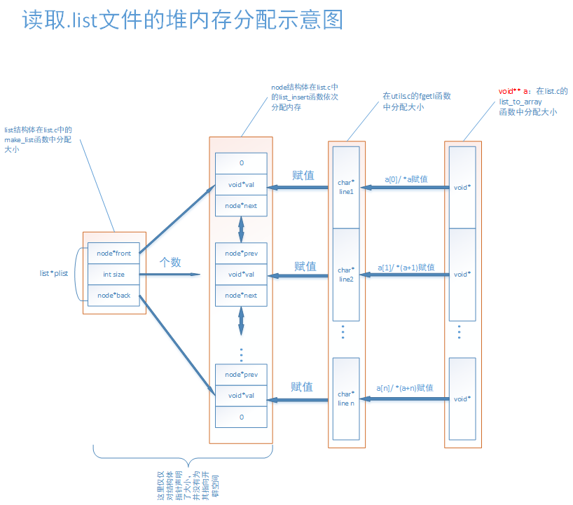
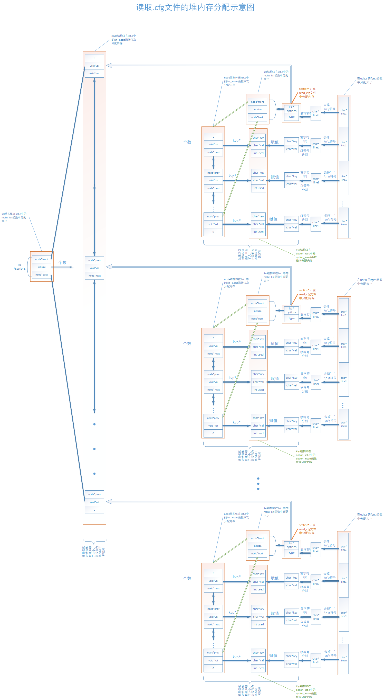
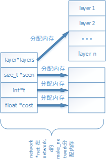
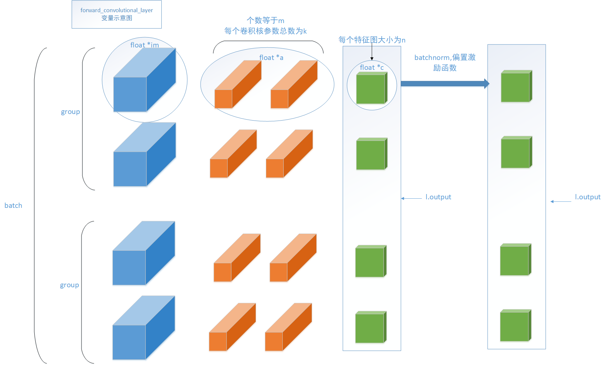
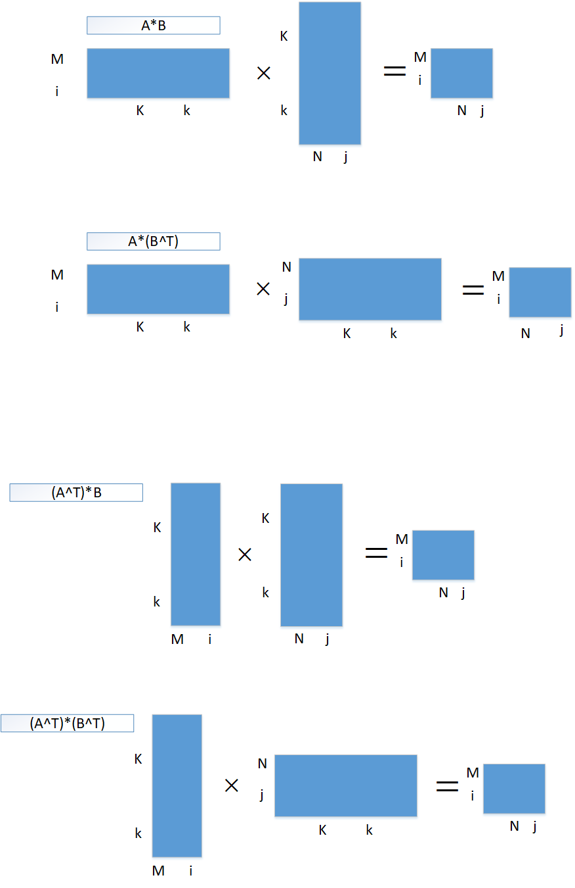
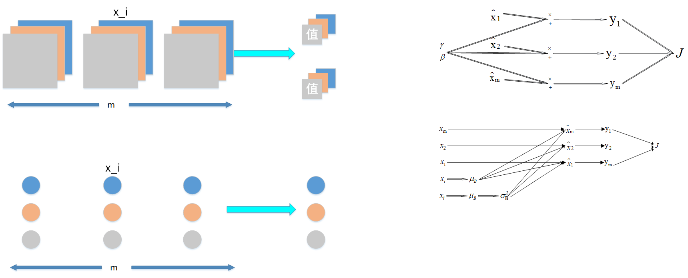

darknet是一个纯C写的框架，支持CUDA。与Tensorflow、Pytorch等大型框架，动辄就几十万行代码相比，darknet具有小型化的的特点。个人一直想知道深度学习框架是怎么实现的，虽然之前已经有人解读过darknet源代码并上传到GitHub了，但是我觉得还是自己看一遍比较好，所以就有了这个项目。

改代码截止到2018年12月10日为官方最新的代码，官方的最新一次提价为`Latest commit 61c9d02  on 14 Sep`。

目前，原理方面已经看到了反向传播，发现之前自己有些注释是错误的，还没来得及改，这里先在github备份一下，之后会不定期更新并更新之前的错误。

> 本人语文水平有限，注释不详细的地方欢迎大家指正。

2018年12月10日：马上就要期末考试了，要开始预习功课了。现在基本完成了卷积层的注释，在注释的过程中，我对C语言的指针和内存管理有了很多新的理解，中间也做了很多笔记，详细可以见[这里](https://www.zdaiot.com/categories/C/)；同时对深度学习反向传播过程进行了详细推导，具体可以见[这里](https://www.zdaiot.com/categories/DeepLearning/)，强烈推荐想深入了解深度学习反向传播过程的同学看[卷积神经网络前向与反向传播](https://www.zdaiot.com/DeepLearning/%E5%8D%B7%E7%A7%AF%E7%A5%9E%E7%BB%8F%E7%BD%91%E7%BB%9C%E5%89%8D%E5%90%91%E4%B8%8E%E5%8F%8D%E5%90%91%E4%BC%A0%E6%92%AD/)和[深度神经网络-DNN](https://www.zdaiot.com/DeepLearning/%E6%B7%B1%E5%BA%A6%E7%A5%9E%E7%BB%8F%E7%BD%91%E7%BB%9C-DNN/)。

> 对于这两篇文章中出现的问题和不当之处，欢迎大家指正。

2019年6月27日：从上次更新到现在，中间忙了很多事情，也就没有更新。前段时间看到了这个框架[NumpyDL](https://github.com/oujago/NumpyDL)，使用纯Python和Numpy实现了基本的层、优化算法、激活函数等。从理解深度学习具体原理的角度出发，看这个框架比看darknet框架，难度更小且更加直观。所以对于想快速深入了解深度学习工作原理的同学，推荐阅读。

工程目录下有darknet.vsdx文件，详细介绍了很多种数据结构。在阅读源代码的时候，可以参考食用。~~~之后我会将截图放在这里，方便大家在Ubuntu下食用。~~~该darknet.vsdx各个页面的png格式放置在`picture`文件夹下。预览如下：

读取.data文件的堆内存分配示意图


读取.list文件的堆内存分配示意图



读取.cfg文件的堆内存分配示意图



解析network*



CNN示意图



geem操作示意图



batchnorm操作示意图



阅读源代码之前，有一个技能是必备的，那就是调试，那么我就先介绍一下是如何调试darknet吧！

## darknet调试
`darknet`源代码是makefile管理的，之前不会在Linux调试大型项目，今天探索了一下，这里介绍一下。

### 准备工作
从[这里](https://github.com/pjreddie/darknet)下载源代码

修改makefile文件中`DEBUG=0`改为`DEBUG=1`进行调试。其中编译选项`-O0`，意思是不进行编译优化，gdb在默认情况下会使用`-O2`，会出现print变量中出现`<optimized out>`。

接着编译源代码：
```
make clean
make
```

根目录会出现`darknet`可执行文件。

在工程根目录运行如下命令下载权重：
```
wget https://pjreddie.com/media/files/yolov3-tiny.weights
```

### 开始调试
终端输入如下语句，开始调试
```
gdb ./darknet
```

在`gdb`命令中输入运行程序需要的参数类型
```
set args detect cfg/yolov3-tiny.cfg yolov3-tiny.weights data/dog.jpg
```

为了对整个工程进行调试，这里需要将`src`目录添加进来，在`gdb`命令中输入如下指令：
```
DIR ./src
```

在`gdb`命令中为`main`函数设置断点
```
b main
```

开始调试，在`gdb`命令中输入`r`，回车，发现程序停留在第一行。

接着可以在第435行，即`char *outfile = find_char_arg(argc, argv, "-out", 0);`，打上断点，在`gdb`命令中输入`c`，回车，程序跳到下一个断点，即停留在该行。输入`s`命令单步执行并跳入此处调用的子函数。输入`print 变量名`或者`p 变量名`即可查看该变量值。输入`finish`跳出子函数。输入`n`单步执行，不跳入子函数。输入`q`结束调试。


#### 命令总结
```
set args detect cfg/yolov3-tiny.cfg yolov3-tiny.weights data/dog.jpg
DIR ./src
b detector.c:569
r
record
```

## 疑问
- option_list.c中的`list *read_data_cfg(char *filename)`函数中的`strip(line);`为何可以改变line的值？即 float* 和 char *的区别
答：该问题表述有误，实际并没有改变line的值(指向)，改变的是line值指向地址的值。

- 神经网络权重初始化问题

- 卷积中偏置的数量以及作用
答：每一个卷积核对应一个偏置(同一个batch中同一个卷积核也是一个参数)。作用为：增加卷积的非线性能力。

- batchnorm_layer.c中的forward_batchnorm_layer函数中 l.rolling_mean 与 l.rolling_variance 怎么求的
答：滚动平均法